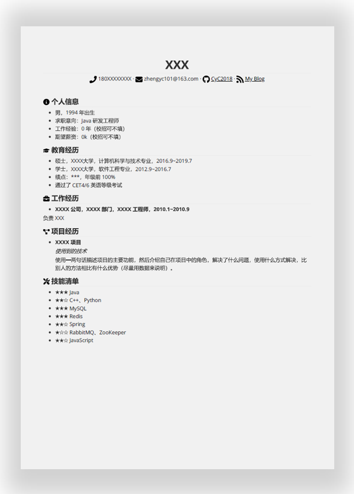
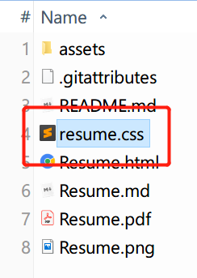
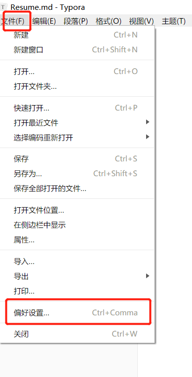
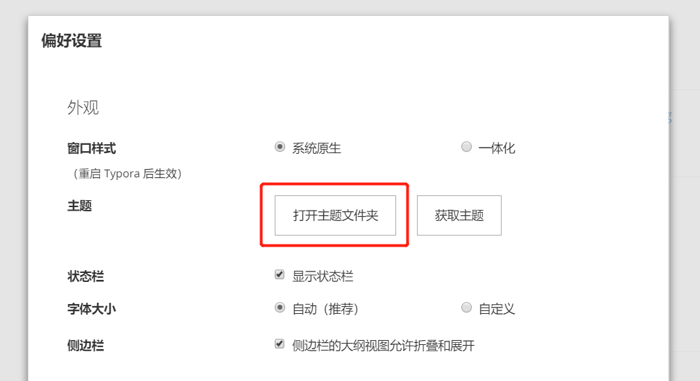
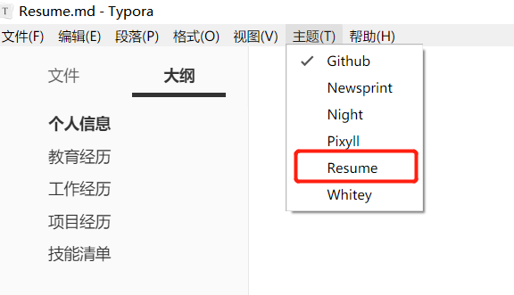
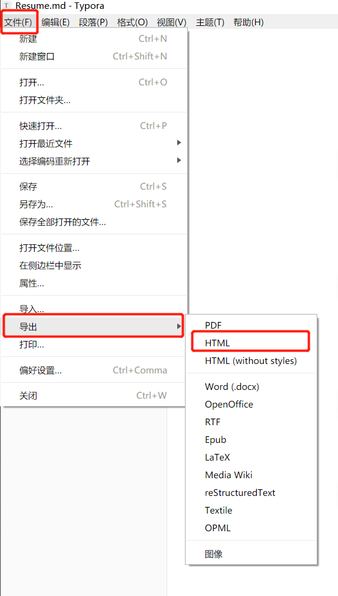
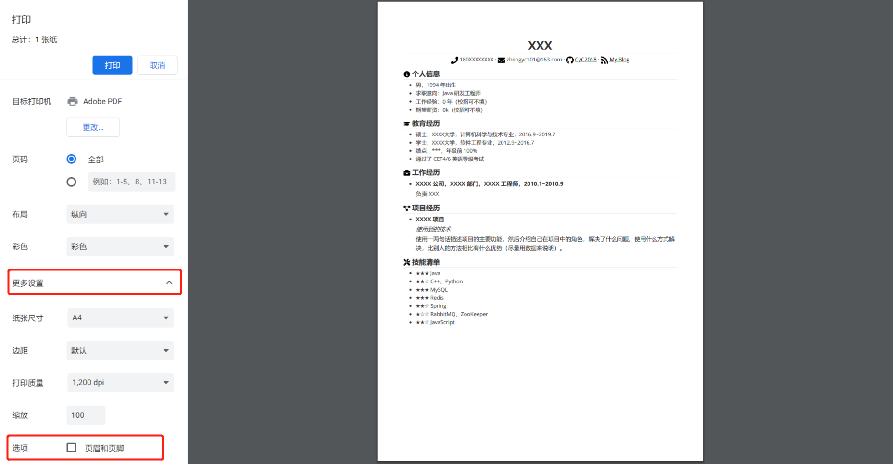
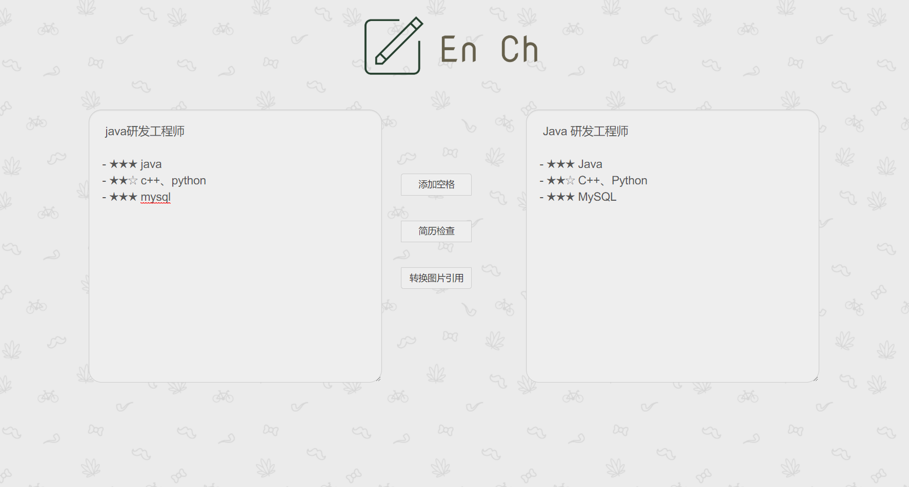

## 如何使用

把该项目 Clone 之后，修改 [Resume.md](Resume.md) 文件即可。

## 导出 PDF

推荐使用 Typora 编辑器，先导出成 HTML，之后再使用浏览器打印成 PDF。

因为 Markdown 格式不够紧凑，需要修改一些样式，否则会让原本只要一页的内容变成两三页。

（1）将 resume.css 复制到 Typora 的主题文件夹

（2）主题文件夹可以在“文件->偏好设置->主题文件夹“中打开

（3）之后重启一下 Typora 编辑器，并在主题中选择 Resume。

（4）使用以下方式导出成 HTML：文件 -> 导出 -> HTML

（5）使用浏览器打开导出的 HTML 文件，并按“ctrl+P”打印，需要去除页眉页脚。

## 简历格式检查

https://cyc2018.github.io/Text-Typesetting/

## 关于图标

因为有些 Markdown 编辑器不支持 HTML 语法，例如 Typora，也就无法导入 fontawesome 样式表。无奈之下只能将本简历模版需要使用到的图标单独下载，放入 assets 目录下，并且在简历中以 `` 标签来引用。我已经对这部分 HTML 代码进行了一定的排版，从而方便大家理解和修改。

## License

- [fontawesome](https://fontawesome.com/license)
