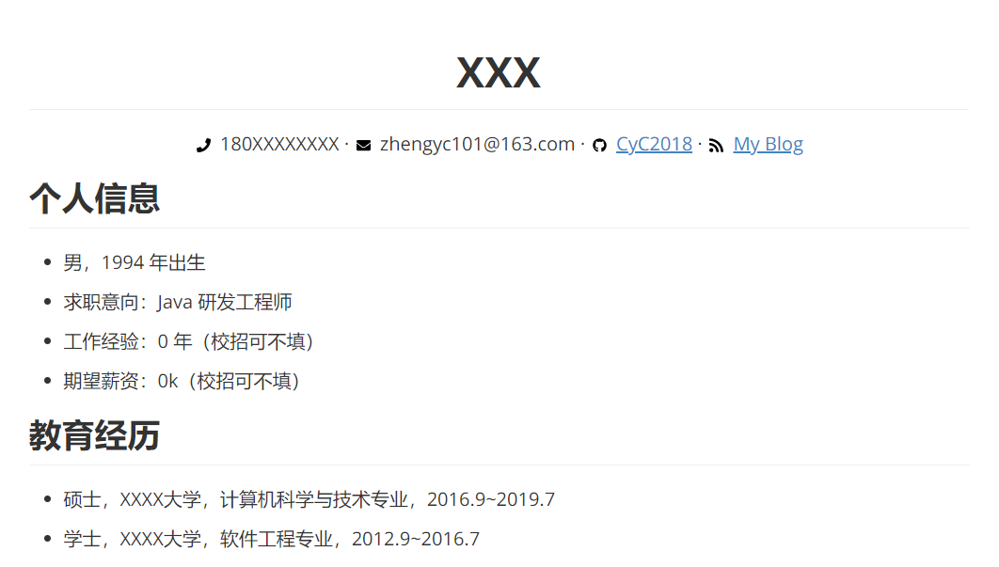

    <h1>
	Markdown-Resume
    </h1>
	

## 如何使用

把该项目 Clone 之后，修改 [Resume.md](Resume.md) 文件即可。

## 导出 PDF

推荐使用 Typora 编辑器，可以导出 PDF。

## 关于图标

因为有些 Markdown 编辑器不支持 HTML 语法，例如 Typora，也就无法导入 fontawesome 样式表。无奈之下只能将本简历模版需要使用到的图标单独下载，放入 assets 目录下，并且在简历中以 `` 标签来引用。我已经对这部分 HTML 代码进行了一定的排版，从而方便大家理解和修改。

## License

- [fontawesome](https://fontawesome.com/license)
